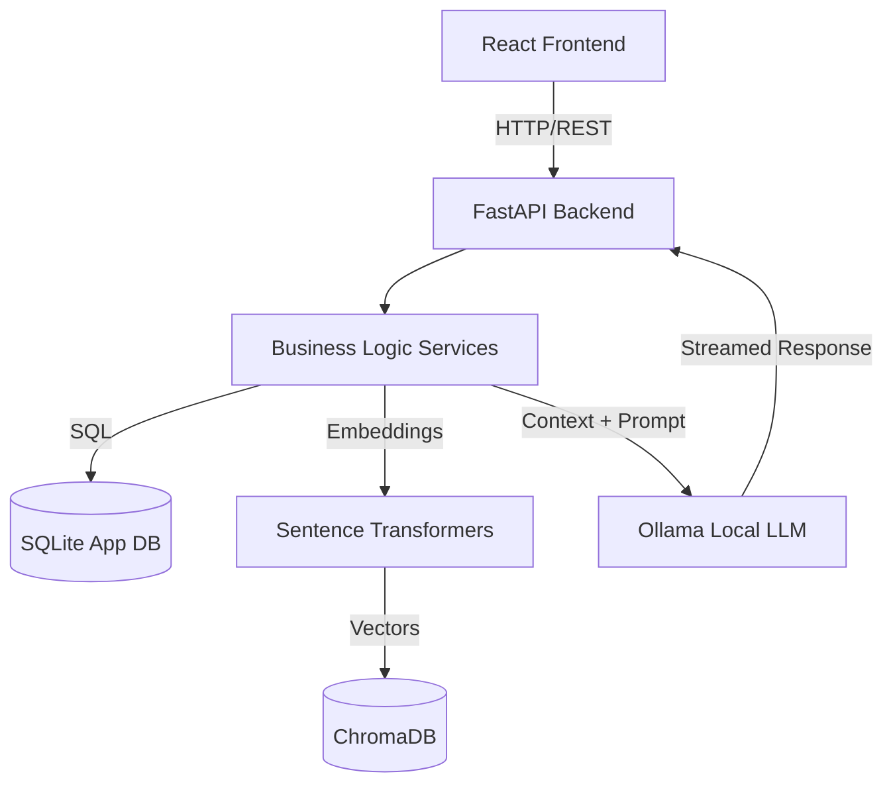
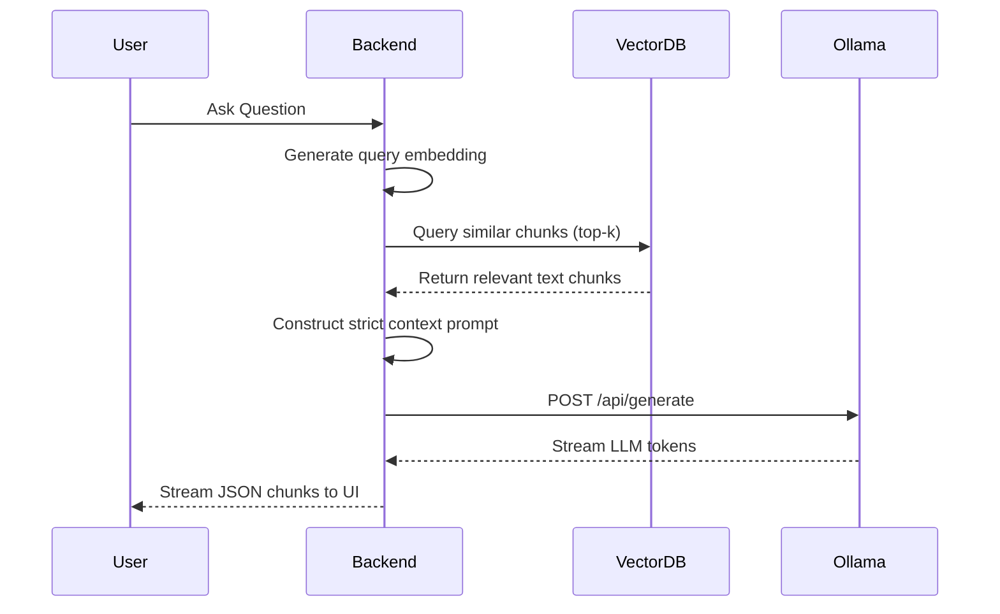

# Complete Technical Audit - Offline Multimodal AI Knowledge Hub

## PART 1 - PROJECT OVERVIEW

**Project Objective**
To build an industry-grade, fully offline Multimodal Retrieval-Augmented Generation (RAG) platform that enables semantic search and conversational interactions with private organizational data without relying on external cloud APIs.

**Problem Statement**
Enterprise environments often possess sensitive documents (PDFs, text, media) that cannot be uploaded to public APIs (like OpenAI) due to data privacy regulations, compliance, and IP leakage risks.

**Why this project is needed**
Organizations require intelligent document retrieval and AI-driven insights but face strict data governance constraints. A fully offline solution mitigates these security risks while providing modern GenAI capabilities.

**Existing Solutions**
Cloud-based RAG platforms (OpenAI Assistants, Pinecone + LangChain hosted solutions) and traditional keyword-based enterprise search engines (ElasticSearch).

**Limitations of Existing Solutions**
1. **Privacy:** Cloud solutions transmit data over the internet, violating data compliance for sensitive sectors.
2. **Cost:** Token-based pricing scales linearly with usage.
3. **Capabilities:** Traditional search lacks semantic understanding and conversational reasoning.

**Our Proposed Solution**
An on-premise, zero-telemetry Multimodal RAG system using local LLMs (via Ollama), local embeddings, and a persistent local vector store (ChromaDB) wrapped in a modern React frontend and FastAPI backend.

**Current Implementation Status**
Core RAG pipeline (Text/PDF ingestion, chunking, ChromaDB storage, semantic retrieval, Ollama generation) is **complete**. The UI is fully functional. Multimodal processors (Video, Audio, Image) are structurally planned but pending full implementation.

**Future Scope**
- Complete multimodal ingestion (Audio transcription via Whisper, Image OCR).
- Multi-user authentication and RBAC.
- Advanced RAG techniques (Hybrid search, Re-ranking).

---

## PART 2 - COMPLETE TECH STACK

### Frontend
- **React 18**
  - *Why:* Component-driven UI, massive ecosystem.
  - *Alternatives:* Vue (less ecosystem for complex enterprise), Angular (steeper learning curve).
  - *Advantages:* Reusable components, fast virtual DOM.
- **Vite**
  - *Why:* Extremely fast HMR (Hot Module Replacement) and build times.
  - *Alternatives:* Webpack (slower), Create React App (deprecated).
- **TypeScript**
  - *Why:* Type safety reduces runtime errors, crucial for complex AI data structures.
- **Tailwind CSS & Shadcn UI**
  - *Why:* Utility-first CSS allows rapid, consistent styling. Shadcn provides accessible, premium UI components.
  - *Advantages:* No CSS bloat, highly customizable.

### Backend
- **FastAPI (Python 3.11+)**
  - *Why:* High performance (ASGI), automatic OpenAPI documentation, asynchronous by default.
  - *Alternatives:* Django (too heavy), Flask (lacks async and built-in validation).
  - *Advantages:* Ideal for AI workloads and asynchronous LLM streaming.
- **Pydantic v2**
  - *Why:* Powerful data validation and serialization.
- **SQLAlchemy & SQLite**
  - *Why:* SQLAlchemy provides a robust ORM. SQLite is perfect for local, zero-config relational storage.
  - *Alternatives:* PostgreSQL (requires separate server setup).

### AI & Data Storage
- **Ollama**
  - *Why:* Simplifies running complex LLMs locally with an OpenAI-compatible API.
  - *Alternatives:* vLLM, text-generation-webui (harder to integrate).
- **Llama 3.2 (3B)**
  - *Why:* Highly efficient local model capable of complex reasoning with low VRAM requirements.
- **ChromaDB**
  - *Why:* Lightweight, persistent local vector database optimized for Python.
  - *Alternatives:* Milvus, Qdrant (heavier setups).
- **Sentence Transformers (BAAI/bge-small-en-v1.5)**
  - *Why:* Fast, highly accurate local embeddings.

---

## PART 3 - COMPLETE PROJECT STRUCTURE

```text
Offline-Multimodal-RAG/
├── backend/                 # Core Python backend
│   ├── api/v1/              # API Endpoints (documents, chat, health)
│   ├── core/                # Configuration (config.py, logging.py, database.py)
│   ├── models/              # SQLAlchemy models (document.py)
│   ├── processors/          # Handlers for extraction and AI mapping
│   │   ├── embeddings/      # SentenceTransformers wrapper
│   │   ├── llm/             # Ollama integration (ollama_service.py)
│   │   ├── vectordb/        # ChromaDB setup (chroma_service.py)
│   │   ├── text/ & pdf/     # Document extraction tools
│   ├── services/            # Business logic (chat_service.py, ingestion.py)
│   └── main.py              # Application entry point
├── frontend/                # React UI codebase
│   ├── src/                 
│   │   ├── components/      # Reusable UI parts
│   │   ├── pages/           # Views (KnowledgeBase, Chat, Dashboard)
│   │   ├── services/        # API Axios clients
│   │   └── types/           # TS Interfaces
├── storage/                 # Persistent local storage (DB, Vectors, Uploads)
```

**Why this structure exists:**
It follows a strict **Domain-Driven Design (DDD)** pattern. `processors` handle specific I/O and AI tasks, `services` orchestrate business logic, and `api` handles HTTP transport. This separation of concerns ensures scalability.

---

## PART 4 - EVERY FILE EXPLANATION (KEY FILES)

| File | Purpose | Key Classes/Functions | Interactions |
|------|---------|-----------------------|--------------|
| `backend/main.py` | FastAPI entry point, lifespan events | `lifespan`, `create_application` | Connects API routers, initializes DB and DB clients. |
| `backend/core/config.py` | Environment configurations | `Settings` class | Used globally for URL and model configs. |
| `backend/core/database.py` | SQLite connection | `get_db()`, `SessionLocal` | Called by API endpoints for DB injection. |
| `backend/models/document.py`| SQL schema for files | `Document` class | Used by `ingestion.py` and `documents.py` router. |
| `backend/services/ingestion.py`| Handles doc ingestion | `process_and_index()` | Reads file -> chunks -> embeds -> stores in Chroma and SQLite. |
| `backend/services/chat_service.py`| Orchestrates RAG | `chat_with_docs()` | Takes query -> Embeds -> ChromaDB search -> Ollama prompt -> Streams. |
| `backend/processors/llm/ollama_service.py` | Ollama HTTP client | `generate_answer()`, `is_healthy()` | Called by `chat_service.py`. |
| `backend/processors/vectordb/chroma_service.py`| ChromaDB wrapper | `add_chunks()`, `query_similar()` | Called by `ingestion.py` and `chat_service.py`. |
| `frontend/src/pages/KnowledgeBase.tsx` | Doc management UI | `uploadFiles()`, `fetchDocuments()` | Calls `/api/v1/documents`. |
| `frontend/src/pages/Chat.tsx` | Chat interface UI | `handleSend()` | Streams from `/api/v1/chat`. |

---

## PART 5 - COMPLETE WORKFLOW

1. **User opens application:** React frontend mounts and checks `/api/v1/health`.
2. **Uploads document:** User uploads PDF/TXT in KnowledgeBase.tsx.
3. **Backend receives file:** `documents.py` router saves it to a temp path and creates a SQL record (`status='uploaded'`).
4. **Text extraction:** A background thread starts `IngestionService.process_and_index()`. Extractors (PyMuPDF) pull raw text.
5. **Chunking:** `RecursiveCharacterTextSplitter` divides text into 700-character chunks with 100-character overlaps.
6. **Embedding generation:** `EmbeddingService` converts chunks into dense vector arrays.
7. **Vector storage:** `ChromaService` saves chunks and embeddings to disk. SQL record updates to `status='indexed'`.
8. **Question asked:** User submits query in Chat UI.
9. **Embedding question:** `ChatService` embeds the user's query.
10. **Vector search:** `ChromaService.query_similar()` runs a cosine similarity search to find top-3 closest chunks.
11. **Prompt creation:** `ChatService` formats the retrieved chunks into a strict context prompt.
12. **Ollama:** Prompt is sent to local Ollama server running Llama 3.2.
13. **Response:** Ollama generates a response with `temperature=0` to prevent hallucination, streaming back JSON chunks.
14. **Frontend:** React receives stream, updates UI in real-time, and displays source citations.

---

## PART 6 - DOCUMENT STORAGE

- **Original Uploads:** Processed directly (temporary paths) or saved in `storage/` if configured.
- **SQLite Database:** Stored at `c:\Users\DHIYANESH\Desktop\Offline-Multimodal-RAG\storage\app.db`. Holds metadata (filename, size, status, chunk_count).
- **ChromaDB Files:** Persistent vector store located at `c:\Users\DHIYANESH\Desktop\Offline-Multimodal-RAG\storage\chromadb`.
- **Embeddings/Extracted Text:** Stored internally inside the ChromaDB SQLite/Parquet files.

---

## PART 7 - OLLAMA ANALYSIS

**File:** `backend/processors/llm/ollama_service.py`
- **API Endpoint:** Communicates over HTTP POST to `http://localhost:11434/api/generate`.
- **Model Passing:** Uses `settings.DEFAULT_LLM_MODEL` (e.g., `llama3.2:3b`).
- **Prompt Template:**
```python
f"You are an AI assistant.\n"
f"Answer ONLY from the provided context.\n"
f"If the answer is not available... reply exactly: 'I could not find this information...'\n"
f"Never hallucinate.\n\n"
f"--- Context ---\n{context}\n\n"
f"--- Question ---\n{question}\n\n"
f"Answer:"
```
- **Execution:** Sent via `httpx.AsyncClient`. Uses `stream=True` to yield chunks iteratively.

---

## PART 8 - VECTOR DATABASE

**File:** `backend/processors/vectordb/chroma_service.py`
- **Initialization:** Uses `chromadb.PersistentClient(path=persist_dir)` to ensure data survives reboots.
- **Collection:** `documents` collection is created/retrieved.
- **Insertion:** `collection.add(ids=..., embeddings=..., documents=..., metadatas=...)`.
- **Search:** `collection.query(query_embeddings=[query], n_results=top_k)`. Uses default cosine similarity.

---

## PART 9 - DATABASE (SQLite)

- **Library:** SQLAlchemy.
- **Table:** `documents`
- **Columns:**
  - `id` (String, PK, UUID)
  - `name` (String, indexed)
  - `type` (String)
  - `size_bytes` (Integer)
  - `status` (String: uploaded, processing, indexed, failed)
  - `uploaded_at` (DateTime)
  - `indexed_at` (DateTime)
  - `chunk_count` (Integer)
  - `error_message` (String)
- **CRUD Operations:** Defined in routing (`GET /api/v1/documents`, `DELETE /api/v1/documents/{id}`).

---

## PART 10 - API DOCUMENTATION

| Method | URL | Request | Response | Purpose / Caller |
|--------|-----|---------|----------|------------------|
| GET | `/api/v1/health` | None | `{"status": "ok", ...}` | System checks. Called by App.tsx. |
| GET | `/api/v1/documents` | None | `{"items": [...]}` | List all files. Called by KnowledgeBase.tsx. |
| POST | `/api/v1/documents/upload` | `multipart/form-data` | `{"id": "...", "status": "processing"}` | Upload files. Called by KnowledgeBase.tsx. |
| DELETE | `/api/v1/documents/{id}` | None | `{"message": "deleted"}` | Delete file & vectors. Called by KnowledgeBase.tsx. |
| POST | `/api/v1/chat` | `{"question": "..."}` | Stream of `{"chunk": "..."}` | Query RAG pipeline. Called by Chat.tsx. |

---

## PART 11 - FRONTEND ANALYSIS

- **Dashboard:** Overview metrics.
- **Knowledge Base:** Data grid managing uploaded documents. Implements polling (3s) to update status from 'processing' to 'indexed'. Includes Drag-and-Drop file handling.
- **Chat:** Interface mimicking ChatGPT. Handles streamed JSON responses to create a typing effect. Displays citation metadata.
- **Sidebar & Layout:** Built with Framer Motion for smooth route transitions.
- **API Integration:** Centralized in `src/services/api.ts` using Axios.

---

## PART 12 - BACKEND ANALYSIS

- **Core (`core/`):** Manages App lifecycle (`lifespan`), Loguru setup for pretty console logs, and environment variable parsing via Pydantic.
- **Processors (`processors/`):** Segregates external systems (Ollama, Chroma) and extraction algorithms from business rules.
- **Services (`services/`):** Orchestrates the workflow. `ingestion.py` marries text extractors with embedding services and DB saves.

---

## PART 13 - COMPLETE RAG PIPELINE

1. **Document Processing:** Normalizes input data.
2. **Chunking:** Prevents context window overflow and improves semantic search accuracy. Overlap prevents cutting off context mid-sentence.
3. **Embedding:** Maps human text into high-dimensional mathematical space where semantic similarity = physical proximity.
4. **Retrieval:** K-Nearest Neighbors (KNN) search in ChromaDB.
5. **Prompt Engineering:** Strict injection of context to ground the LLM and prevent hallucinations.
6. **Generation:** LLM formulates human-readable answers.

---

## PART 14 - CURRENT IMPLEMENTATION STATUS

- **Completed:** 
  - Full UI framework and routing.
  - SQLite backend database and ORM.
  - PDF/TXT text extraction and ingestion.
  - Chunking and Embeddings setup.
  - ChromaDB persistent storage.
  - Ollama integration with strict prompting.
  - Streaming Chat UI.
- **Partially Completed:** Analytics dashboard (currently mock data).
- **Missing / Future:** Image (OCR), Audio, Video extractors.
- **Estimated Completion Percentage:** **75%** (The most complex algorithmic parts are fully functional).

---

## PART 15 - LITERATURE SURVEY COMPARISON

| Paper / Concept | Method | Technology | Limitation | How my project improves it |
|-----------------|--------|------------|------------|----------------------------|
| Standard RAG | Naive search | Pinecone / OpenAI | Cloud dependent, privacy issues | Fully offline execution, zero telemetry. |
| Enterprise Search | Keyword matching | ElasticSearch | Lexical only, poor reasoning | Semantic vector search + LLM synthesis. |
| Local LLM UI | Raw chat | Ollama WebUI | No document context awareness | Integrated document ingestion and RAG pipeline. |

**What makes this unique:** It achieves enterprise-grade UI/UX and asynchronous processing entirely on local hardware, bridging the gap between secure on-premise systems and modern AI architectures.

---

## PART 18 - PROJECT FLOWCHARTS

### Overall Architecture


### RAG Flow


---

## PART 19 - CODE EXPLANATION (Major Modules)

**1. `chat_service.py`**
- *Problem:* Needs to coordinate embedding generation, DB search, and LLM streaming without blocking the server.
- *Algorithm:* Embed query -> Chroma query -> String concatenation -> Async HTTP stream from Ollama.
- *Time Complexity:* `O(E + k * d + L)`, where E is embedding time, k is top-k search, d is embedding dimension, L is LLM generation time.
- *Future Optimization:* Implement query reformulation or re-ranking (Cohere/Cross-encoders) before sending to the LLM.

**2. `ingestion.py`**
- *Problem:* Converting massive documents into search-ready vectors.
- *Algorithm:* Read -> Clean -> Split (700 chars) -> Embed loop -> Batch Insert Chroma -> Update SQLite.
- *Space Complexity:* `O(C * D)`, where C is number of chunks and D is embedding dimension (e.g., 384 floats).

---

## PART 20 - REVIEW REPORT

**Complete Project Summary**
The Offline Multimodal AI Knowledge Hub is a robust, privacy-centric AI application. It successfully implements a local RAG pipeline using state-of-the-art open-source tools (FastAPI, React, Ollama, ChromaDB).

**Strengths**
- 100% offline, addressing enterprise privacy concerns.
- Excellent architectural separation (DDD principles).
- High-performance asynchronous backend and streaming frontend.

**Weaknesses**
- Dependent on local hardware capabilities (requires sufficient RAM/VRAM).
- Multimodal features (audio/video) are architected but not yet fully implemented.

**Risk Areas**
- If the document volume grows extremely large, local embedding generation might bottleneck without GPU acceleration.
- ChromaDB persistent storage can grow large over time.

**Suggestions before final review**
1. Implement a basic visual loading state for Ollama model warm-up.
2. Add a clear disclaimer about hardware requirements.

**Scores**
- Code Quality: 9/10 (Excellent use of types, async, and logging).
- Architecture: 9.5/10 (Clean separation of concerns).
- Scalability: 7/10 (Bounded by single-node local hardware limits).
- Maintainability: 9/10 (Modular and well-documented).

**Estimated Project Completion:** 75%
